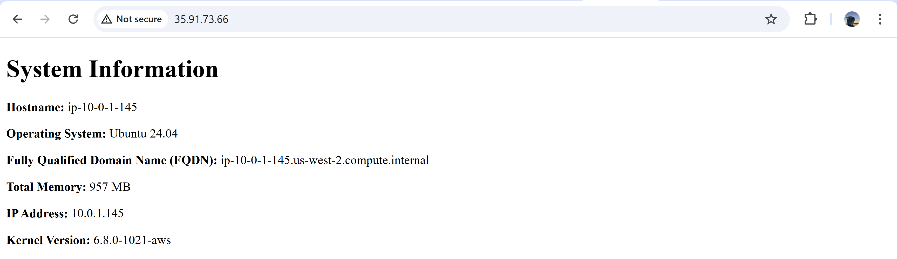

# ACIT 4640 - Lab Week 7

This repository contains the files necessary to configure EC2 instances using Ansible. The playbook installs Nginx, sets up directories, and configures the Nginx server for a simple static site.

## Prerequisites

- **Terraform** must be set up to create EC2 instances.
- **Ansible** must be installed on your local machine.
- **AWS EC2 instances** must be running.
- An **SSH key** (`aws`) is required to authenticate with EC2 instances.

## Setup Steps

### 1. Generate a New SSH Key

To generate a new SSH key pair and save it to the `~/.ssh/` directory, I ran:

```bash
ssh-keygen -t rsa -b 4096 -f ~/.ssh/aws -N ""
```

- `-t rsa`: Specifies the key type (RSA).
- `-b 4096`: Creates a 4096-bit key for improved security.
- `-f ~/.ssh/aws`: Saves the key to the `~/.ssh/aws` directory with the name `aws`.
- `-N ""`: Creates the key without a passphrase.

### 2. Import the Public Key to AWS

After generating the SSH key pair, I used the `import_lab_key` script to upload the public key to AWS so that Ansible can authenticate using the `aws` SSH key.

```bash
./import_lab_key ~/.ssh/aws.pub
```

### 3. Run Terraform to Create EC2 Instances

In the `terraform` directory, I initialized and applied the configuration to create the EC2 instances:

```bash
cd terraform
terraform init
terraform apply
```

Terraform will then output the public IPs and DNS names of the EC2 instances.

### 4. Update the Ansible Inventory File

I edited the `ansible/inventory/hosts.yml` file to include the public IPs or DNS names of my EC2 instances. My file looked like this:

```yaml
all:
  children:
    web:
      hosts:
        server-one:
          ansible_host: 35.91.73.66
          ansible_user: ubuntu
          ansible_ssh_private_key_file: ~/.ssh/aws
        server-two:
          ansible_host: 35.94.123.46
          ansible_user: ubuntu
          ansible_ssh_private_key_file: ~/.ssh/aws
```

`35.91.73.66` and `35.94.123.46` were the Public IPs of my instances.

### 5. Run the Ansible Playbook

To configure the EC2 instances, I ran the playbook using the following command:

```bash
ansible-playbook -i ansible/inventory/hosts.yml ansible/playbook.yml
```

This command does the following:
- Installs Nginx on both EC2 instances.
- Creates necessary directories.
- Copies configuration files.
- Creates a symbolic link for the Nginx configuration.
- Generates an index.html file from a template.
- Reloads and enables the Nginx service.

### 6. Verify Nginx Installation

Once the playbook ran successfully, I opened a browser and navigated to the public IP or DNS of either EC2 instance to check that Nginx was running:

```
http://35.91.73.66
```

I saw the static website served by Nginx.

### Screenshot

Here is a screenshot of the rendered HTML page from one of my servers:


---

## Cleanup

When done, I ran Terraform destroy to remove the EC2 instances:

```bash
cd terraform
terraform destroy
```

To remove the SSH key from AWS, I ran the delete_lab_key script:

```bash
./delete_lab_key
```
